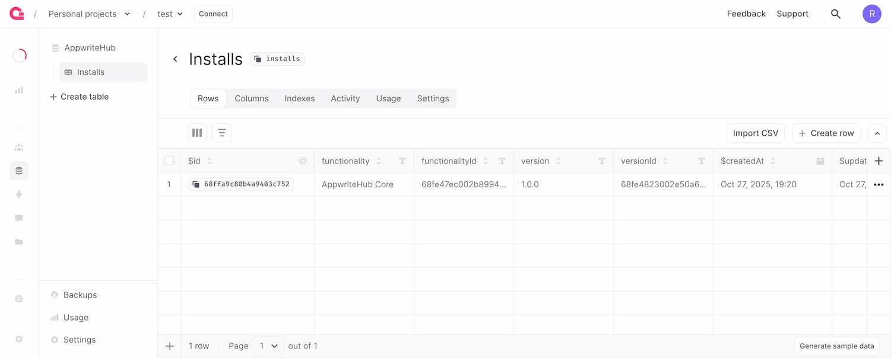

# AppwriteHub Core

The Core serves as the project's central deployment registry - enabling seamless, one-click installs and updates directly from your AppwriteHub Dashboard.

**This functionality will be installed automatically in all linked projects.**

## What's included

### Databases

- **AppwriteHub**
	- Installs

## Template

You can use this functionality as a template when developing your own.

Proposed features:
- `.appwritehub` folder which will contain all the files needed by AppwriteHub when creating the Functionality listing (including: images, metadata, etc.) - **Community feedback is welcomed**