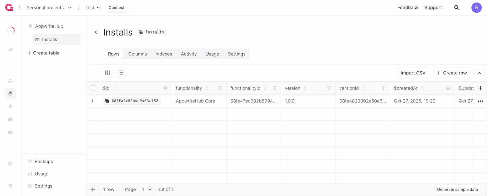

# AppwriteHub Demo

You can use this functionality as a template when developing your own.

Proposed features:
- `.appwritehub` folder which will contain all the files needed by AppwriteHub when creating the Functionality listing (including: images, metadata, etc.) - **Community feedback is welcomed**

## What's included

### Databases

- **AppwriteHub**
	- Installs

